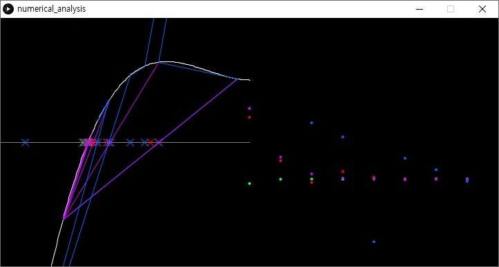

# Comparison between some root-finding algorithm

심심해서 `processing 3`으로 만들어본 'Root-finding 알고리즘 비교'입니다. 

대상 알고리즘으로 총 4가지를 비교합니다.

- Bisection Method
- Newton's Method
- Secant Method
- Regular Falsi

2가지 그래프를 그리는데, 하나는 함수 상에서 근사해를 어떻게 찾아가는지를 보여주며, 다른 하나는 얼마나 수렴하고 있는지를 점으로 나타냅니다.

수치해석 복습용으로 만든 것이라 실용성은 없습니다.